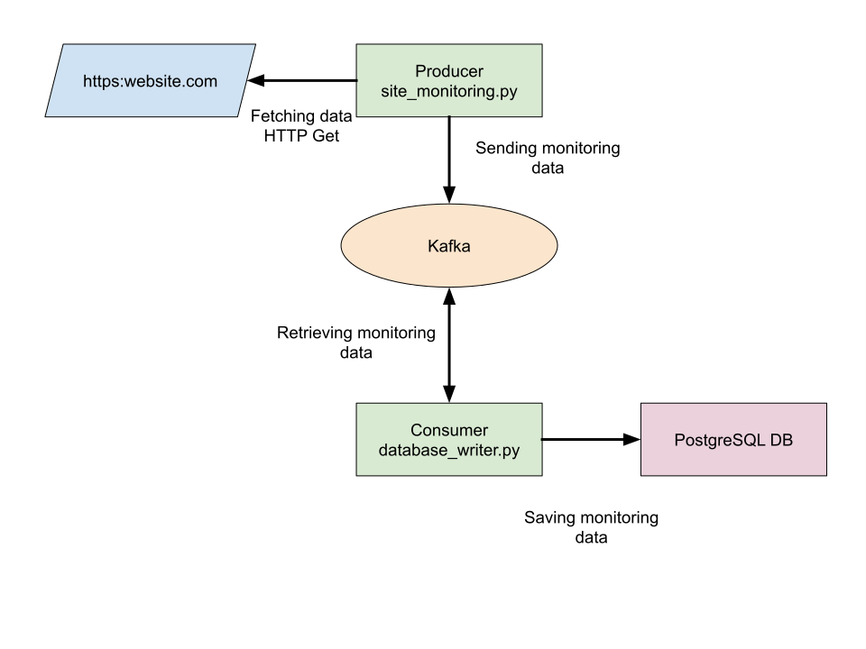

# Website monitoring

Website monitoring using Python / Kafka / PostgreSQL with Aiven



# Installation

To simplify the installation a makefile is available.

Using `make install` will install all the dependencies needed with pip3.

Please ensure to have Python3 and pip3 installed on your machine.

# Configuration

Configuration file example

`config.json`

```json
{
  "kafka": {
    "kafka_url": "kafka-site-monitoring-kenzo-134a.aivencloud.com:16845",
    "ssl_ca_file": "ca.pem",
    "ssl_access_certificate_file": "service.cert",
    "ssl_access_key_file": "service.key"
  },
  "database": {
    "uri": "postgres://<user>:<password>@pg-site-monitoring-kenzo-134a.aivencloud.com:16843/site_monitoring?sslmode=require"
  }
}
```

# Usage

## Producer

```bash
# Argument description
python3 site_monitoring.py -h

# Execution
python3 site_monitoring.py -c <configuration_file> -t <website_url> -i <polling_interval>
```

## Consumer

```bash
# Argument description
python3 database_writer.py -h

# Execution
python3 database_writer.py -c <configuration_file>
```

## Tests

Execute unit tests:

```bash
make test
```

Execute test coverage report

```bash
make coverage
```

## Sample

To run sample scripts, commands have been incorporated in the make file as such you can:

Start the producer:

```bash
make producer
```

Start the consumer:

```bash
make consumer
```

# Dependencies

```bash
pip3 install requests ;
pip3 install kafka-python ;
pip3 install psycopg2 ;
pip3 install argparse ;
pip3 install pytest ;
pip3 install coverage
```

# Ressources used

## Aiven

- https://help.aiven.io/en/articles/489572-getting-started-with-aiven-kafka
- https://help.aiven.io/en/articles/489573-getting-started-with-aiven-postgresql

## Official documentations

- https://kafka.apache.org/documentation/
- https://www.python.org/dev/peps/pep-0008/
- https://www.postgresql.org/docs/

## Python

- https://towardsdatascience.com/30-python-best-practices-tips-and-tricks-caefb9f8c5f5
- https://towardsdatascience.com/getting-started-with-apache-kafka-in-python-604b3250aa05
